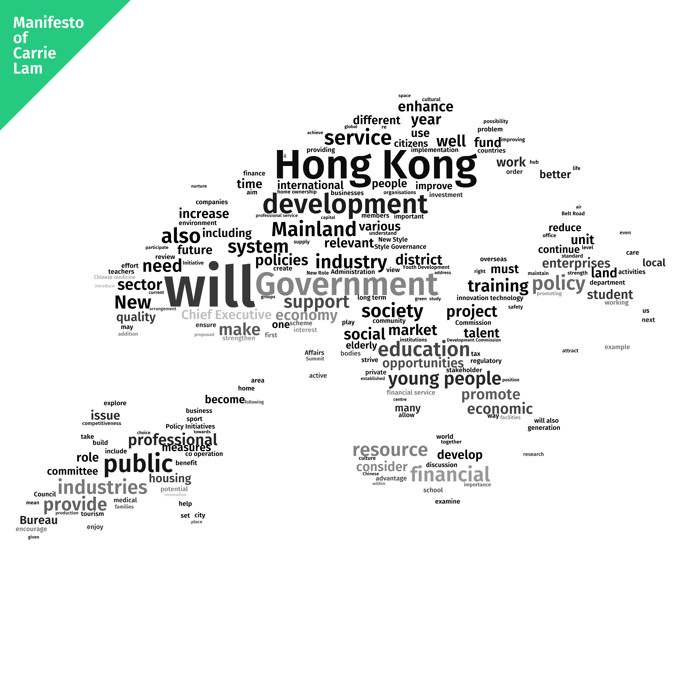

# Hong Kong Manifesto Word Cloud

This project aims to visualise the focus on different topics mentioned in the manifesto of Carrie Lam, the current Chief Executive of Hong Kong.

## File Tree
.
├── README.md
├── data
│   ├── Manifesto_words_E_revised.pdf
│   ├── Manifesto_words_E_revised.txt
│   └── hk_mask.png
├── hk_wc.png
├── manifesto_wc.py
└── ttf
    ├── FiraSans-Light.ttf
    └── FiraSans-SemiBold.ttf

The manifesto is obtained from http://www.ceo.gov.hk/eng/pdf/Manifesto_words_E_revised.pdf and converted to plain text with [pdftotext](https://en.wikipedia.org/wiki/Pdftotext).

## Python Dependencies

 - PIL
 - wordcloud
 - numpy

## Image result

## TODO

 - Generate more wordclouds from successive Chief Exectives' manifesto for comparison.

## Credits

The projects contains FiraSans font which is published by Carrois Apostrophe under Open Font Licenes (OFL).  
[Fira's repo](https://github.com/mozilla/Fira)

## License

MIT
